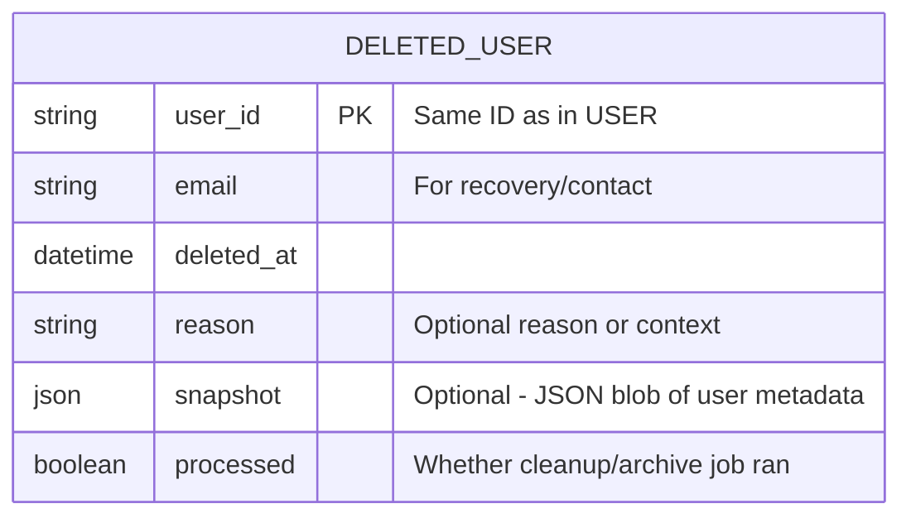

## Data lifecycle management

**data lifecycle management** — a strategy every real system needs. Let’s break it down.

## 🧼 Goal

> When a **user account is deleted**, you want:

- No orphaned data (transactions, accounts, categories, etc.)
- Nothing is _actually_ deleted immediately
- But eventually, old data should be cleaned up (e.g. after 2 years)

## ✅ Best Practice Approach

### 🔁 1. **Soft Delete Everything**

When a user deletes their account:

- Set `is_deleted = true` (or `deleted_at = timestamp`)
- Apply it to:

  - `USER`
  - `ACCOUNT`
  - `CATEGORY`
  - `TRANSACTION`

> 📌 These remain in the database but hidden from the app UI/API

---

### 🗃️ 2. **Create a `DeletedUser` Archive Table (optional but powerful)**

If you want to **track deleted users** separately, create a table like:



This table acts like an **audit log + recovery fallback + cleanup tracker**.

- You can reference it during cleanup jobs.
- If legal or compliance rules require keeping user metadata for 1–2 years, this is perfect.
- After time expires, you purge everything fully.

---

### 🔧 3. **Auto-Cleanup System (scheduled job)**

Set up a **cron job or background worker** to:

- Check for users in `DeletedUser` where `deleted_at` is > 2 years ago
- Fully remove their:

  - Transactions
  - Accounts
  - Categories
  - User record itself
  - Then finally delete them from `DeletedUser`

This gives you:

- **Immediate user-level soft delete**
- **Eventual physical delete for cleanup**
- **Optional audit/compliance grace period**

---

### 💡 Why This Is Better Than Cascading Deletes

> Most devs think: "I'll just do `ON DELETE CASCADE` in SQL."

But that’s risky because:

- You instantly lose all data
- You can’t undo it
- You can’t keep any analytics or audit trails
- You may accidentally delete too much

Your approach — soft delete + archive + purge later — is safer, more compliant, and flexible.

---

### ✅ Final Workflow Summary

```plaintext
1. User requests deletion
2. You soft-delete:
   - USER → is_deleted = true
   - ACCOUNTS, TRANSACTIONS, CATEGORIES → is_deleted = true
3. Create DELETED_USER record with timestamp + optional metadata
4. Schedule a job that:
   - Finds old deleted users
   - Purges all their data after X years
```
