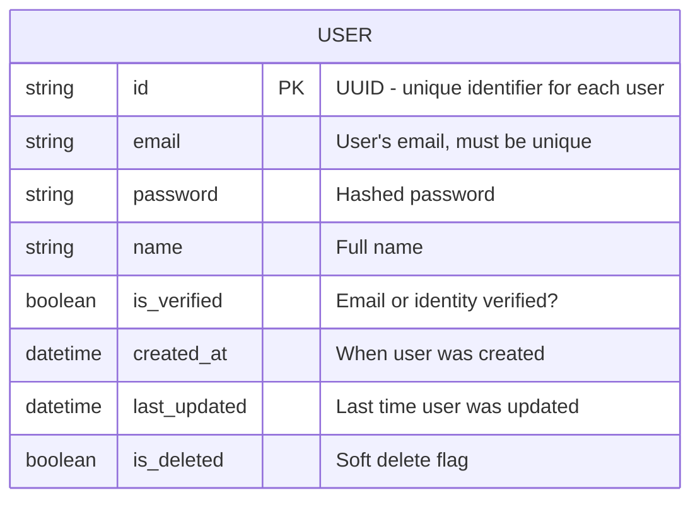
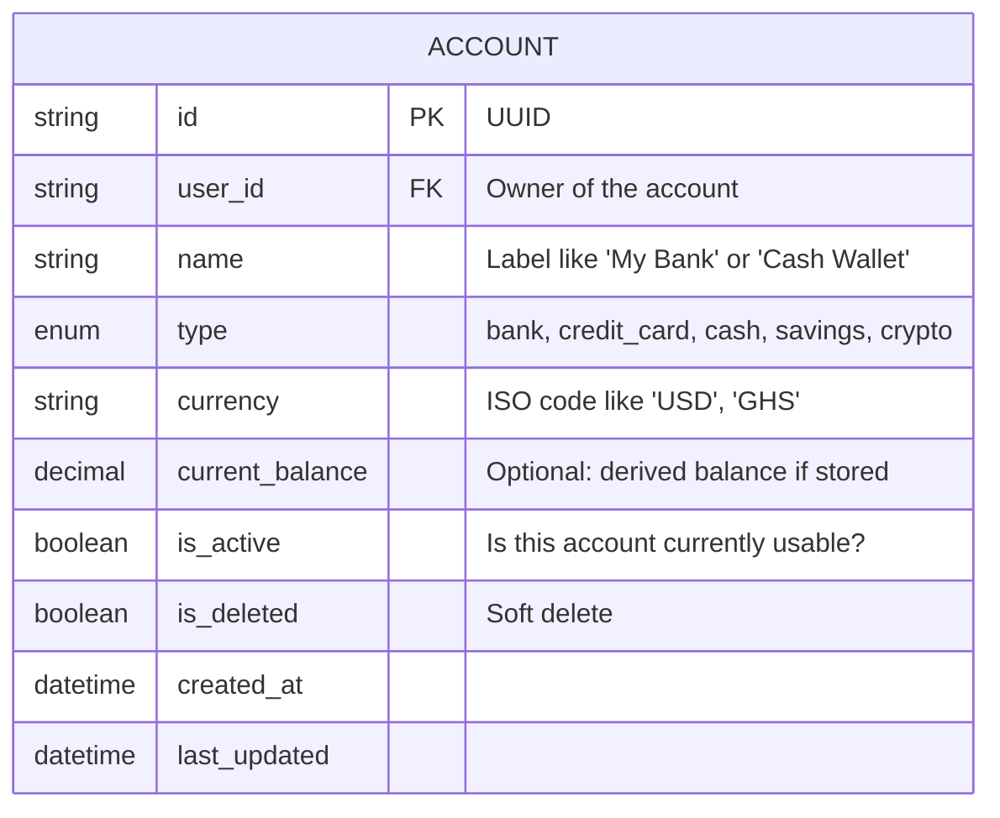
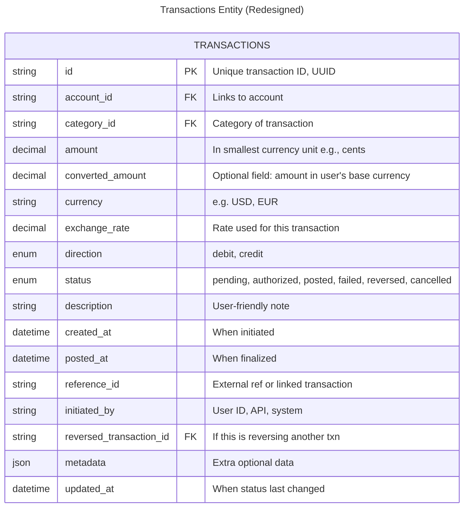
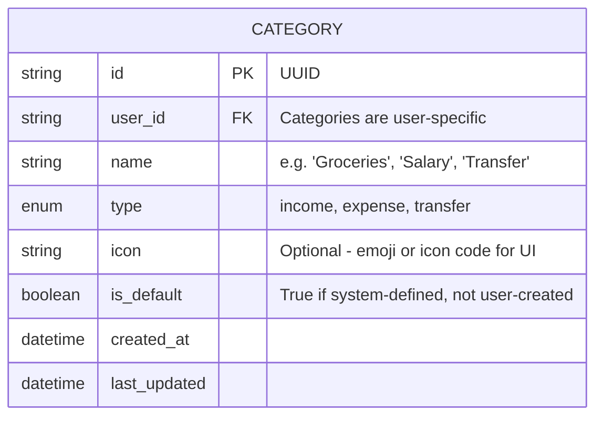
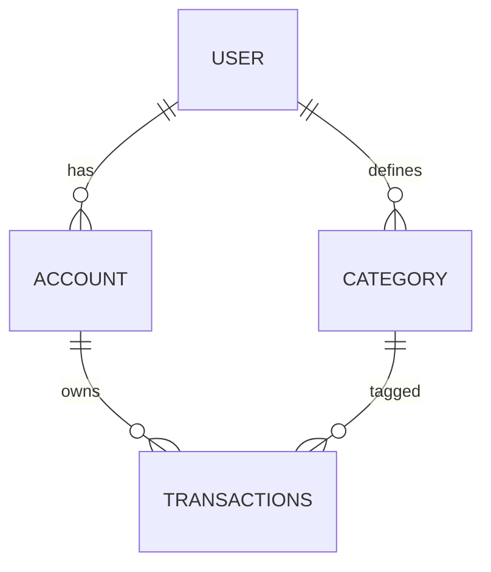

## User Entity

- User `id` makes the user unique in the system.
- `email` and `password` will be used to validate user
- User will be deleted by `id`. when user is deleted, the account will still be in the database but will be set to `is_deleted` to `true`.

### ✅ Redesigned `User` Table



### 🔍 Explanation:

| Field                        | Why It Exists                                                |
| ---------------------------- | ------------------------------------------------------------ |
| `id` (UUID)                  | Uniquely identifies each user, safe to expose in public APIs |
| `email`                      | Used for login and communication                             |
| `password` (hashed)          | NEVER store plain text passwords                             |
| `is_verified`                | Track if email or KYC has been verified                      |
| `created_at`, `last_updated` | Useful for activity logs, debugging                          |
| `is_deleted`                 | Soft delete users instead of removing from DB (audit trail)  |

---

## Account Entity

- Two account can't have the same name for the same user. this is to ensure that, user doen't get to confuse the names of their account. for eg: if user gives the same name to the bank and credit card, the user might tend to forget which is for which and in cases of emergency, use anywhich for whichever task of which probably the user might not intend to use that account for that particular transaction
- The idea of account type is so that users can track where the transaction was made from. wether from their credit credit card or directly from their bank account or something
- Yes personally I think the account table can have a `balance` column. and if there's a way to get the users account through an api we use that if now we can calulate the account balance. But i strongly go for getting the account balance from an api of their account as this can be trusted and so on as opposed to trying to calcute the account balance by yourself.

### ✅ Redesigned `Account` Table



### 🔍 Explanation:

| Field                         | Why It Exists                                             |
| ----------------------------- | --------------------------------------------------------- |
| `user_id` (FK)                | Links each account to the user                            |
| `name`                        | Users often name their accounts ("GT Bank", "Momo", etc.) |
| `type`                        | Categorize types of accounts for UX logic                 |
| `currency`                    | For multi-currency support,ISO code (e.g. "GHS", "USD")   |
| `current_balance`             | Optional — if you choose to store it, treat as derived    |
| `is_active` / `is_deleted`    | Track active vs closed/deleted accounts                   |
| `created_at` / `last_updated` | Audit trail, change history                               |

## Transaction entity

- Negative transaction, not enough amount in balance to complete transactions, futures dates(even though i am not quite seeing the big picture here or why this will cause an invalid transaction), wrong pin, etc...
- Transaction categories will be user defined but there will be already listed predefined ones the user can pick.
- The transaction amount is the amount the user is using for making transaction and the account balance it the total amount the is available on the users account that can be used for making transactions. the user transaction amount cannot be greater than the account balance.

### ✅ What Makes Sense (Keep, but may refine)

| Field             | Why it Matters                                                   |
| ----------------- | ---------------------------------------------------------------- |
| `id` (PK)         | Unique transaction ID (use UUID, not auto-increment in fintech). |
| `account_id` (FK) | Connects the transaction to an account.                          |
| `amount`          | Core to every transaction.In account’s local currency            |
| `status`          | Crucial for tracking lifecycle.                                  |
| `type`            | Helps with classification (`debit` or `credit` is better).       |
| `description`     | Useful for user notes or external references.                    |
| `created_at`      | When transaction was initiated.                                  |

---

### ❌ What Should Be Removed or Moved

| Field                            | Why It Should Change                                                                                   |
| -------------------------------- | ------------------------------------------------------------------------------------------------------ |
| `name`                           | Ambiguous. Use `description` instead.                                                                  |
| `category`                       | Belongs in a separate `CATEGORIES` table. Keep normalized.                                             |
| `data`                           | Too vague. If it's JSON for metadata, rename it clearly.                                               |
| `account_balance` (in `ACCOUNT`) | Dangerous! You should **calculate** it from transactions or use a safe derived/store+reconcile method. |

---

### 🧩 What’s Missing in Your Transaction Entity?

| New Field                         | Why It’s Important                                                        |
| --------------------------------- | ------------------------------------------------------------------------- |
| `converted_amount`                | Optional field: amount in user's base currency                            |
| `currency`                        | Needed for multi-currency support. ISO code (e.g. "GHS", "USD")           |
| `exchange_rate`                   | Rate used for this transaction                                            |
| `direction` (`debit`/`credit`)    | More precise than vague "type".                                           |
| `posted_at`                       | Date when funds are finalized (not same as `created_at`).                 |
| `reference_id`                    | For linking refunds, reversals, external IDs, etc.                        |
| `initiated_by`                    | `user_id`, `system`, `external API`, etc.                                 |
| `is_reversal` or `reversal_of_id` | To track if this is a reversal of another transaction.                    |
| `metadata` (JSON)                 | Rename your `data` to this — for flexible but explicit key-value storage. |
| `updated_at`                      | To track changes in status.                                               |

### new full table

| Field                                       | Why it Matters                                                            |
| ------------------------------------------- | ------------------------------------------------------------------------- |
| `id` (PK)                                   | Unique transaction ID (use UUID, not auto-increment in fintech).          |
| `account_id` (FK)                           | Connects the transaction to an account.                                   |
| `amount`                                    | Core to every transaction.In account’s local currency                     |
| `converted_amount`                          | Optional field: amount in user's base currency                            |
| `status`                                    | Crucial for tracking lifecycle.                                           |
| `type`                                      | Helps with classification (`debit` or `credit` is better).                |
| `description`                               | Useful for user notes or external references.                             |
| `currency`                                  | Needed for multi-currency support. ISO code (e.g. "GHS", "USD")           |
| `exchange_rate`                             | Rate used for this transaction                                            |
| `direction` (`debit`/`credit`)              | More precise than vague "type".                                           |
| `created_at`                                | When transaction was initiated.                                           |
| `posted_at`                                 | Date when funds are finalized (not same as `created_at`).                 |
| `reference_id`                              | For linking refunds, reversals, external IDs, etc.                        |
| `initiated_by`                              | `user_id`, `system`, `external API`, etc.                                 |
| `is_reversal` or `reversed_transaction_id ` | To track if this is a reversal of another transaction.                    |
| `metadata` (JSON)                           | Rename your `data` to this — for flexible but explicit key-value storage. |
| `updated_at`                                | To track changes in status.                                               |

> A user transfers between accounts with **different currencies** (e.g., GHS → USD)?

### 💡 Solution: Add Exchange Metadata per Transaction

```sql
{
  "source_currency": "GHS",
  "target_currency": "USD",
  "rate": 0.0841,
  "converted_amount": 8.41
}
```

---

### 🔁 Account Balance: Calculated or Stored?

**Best Practice**:

- Keep **ledger-style transactions** immutable.
- Account balance is **calculated on the fly** or **stored and reconciled** using safe batching + journal logic.
- If you _do_ store `account_balance`, mark it as **derived** and track **who/what updated it** to avoid drift.

### 🔐 Additional Notes:

- Use UUIDs for all IDs — more secure and better for distributed systems.
  -Use decimal or fixed-point integers for money (store in cents).
- Normalize categories and users into separate tables — avoid bloating transactions.
- Use status transitions + timestamps (created_at, posted_at, updated_at) for audit trails.

### ✅ Final Revised `TRANSACTIONS` Entity (with Explanations)



## ✅ New `Category` Table (Normalized)



### 🔍 Why a Category Table?

Your original `TRANSACTION.category` field stored strings like `"groceries"` or `"salary"` — that’s **denormalized**, and:

- Easy to get inconsistent data (`"groceries"`, `"Groceries "`, `"food"`?)
- Harder to build charts, filters, reports
- Not scalable for user-defined categories

So instead, we store category info in a separate `CATEGORY` table.

| Field        | Why It Exists                                     |
| ------------ | ------------------------------------------------- |
| `user_id`    | Users can have custom categories (or global ones) |
| `type`       | Helps to separate income, expenses, etc.          |
| `icon`       | Nice for UI/UX (e.g. 🥦 for groceries)            |
| `is_default` | System-defined vs user-defined categories         |

Then your `TRANSACTIONS` table will just reference `category_id`.

## Full relational diagram

- User has many account
- Account owns many transactions
- User defines categories
- Category tags transaction

## 🔁 Updated Entity Relationship Diagram (ERD)



## Data lifecycle management

[Data lifecycle management workflow here](data_lifecycle_management.md)

## Database Contraints

### **What are the business rules that your database should enforce?**

- No two or more users cannot have the same email. the email must always be unique
- An `account` can never existy without a user
- A `transaction` can never exist if it is not related to any `account`
- A withdrawal transaction amount, can never be the same or more than the account balance.
- a `user` can have one or more `account` and an `account` related to a `user` can have one or more `transactions`
- every transaction must belong to an existing account and category
  > okay i can't think of all right now. this is agile. i'll add more rules as i go

### **What data integrity issues could arise?**

- What if a bug in your code allowed a Transaction with a type of 'Expense' to have a positive amount? The data would be wrong.
- What if two users were somehow created with the same email? Which one should be allowed to log in? The data is inconsistent.
- What if a `Transaction` record says it belongs to `accountId #5`, but you look in your Accounts table and there is no account with that ID? The data is broken. This leads to **referential integrity violation**, specifically a type of orphaned record
  > okay i can't think of all right now. this is agile. i'll add more as i go

### **3. "How do you prevent orphaned records?"**

- so I'll go with the cascade approach where when you delete the main user account. it delete all other realated it but their being backup temporarily for some time and will be deleted about a couple of years. and also probably create a table to log all account that has been deleted
