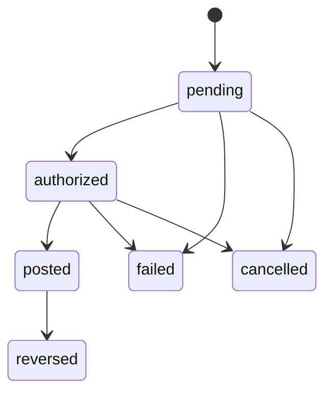

### **1. referential integrity violation**

- A **referential integrity violation** occurs when a foreign key in one table references a non-existent primary key in another table. This means the relationship between the two tables is broken, leading to data inconsistency.

> https://www.google.com/search?cs=1&sca_esv=571e9f62cdadf4fd&sxsrf=AE3TifM_UaVNYgE2DBYiidd1ThaKm96sQw%3A1753171082180&q=referential+integrity+violation&sa=X&ved=2ahUKEwjy3Mqc_8-OAxUUVUEAHZ3wHvEQxccNegQIAhAB&mstk=AUtExfDXVSz-O9fKn1jTIcYdQdUbpxWyM6FjjuYmSCe-bjZNPh20ESPKJLoFoan4HLuwY2VqStiZAcXs9Oewcqx3w1azd0k9caLp8-N-fElT9D_DarJIWYnvi7xYdrMcdA1Nc5PAfLXKoFB8Uiyhcooeekt2ZUskozoaGuWEqPta4DUL-ds&csui=3

### **2. orphaned record**

- In database management, an orphaned record refers to a record that has a foreign key referencing `a non-existent primary key in another table`.
- This typically happens when a related record is deleted without updating the foreign key value in the referencing record.
  > https://www.google.com/search?cs=1&sxsrf=AE3TifM_UaVNYgE2DBYiidd1ThaKm96sQw%3A1753171082180&q=orphaned+record&mstk=AUtExfDXVSz-O9fKn1jTIcYdQdUbpxWyM6FjjuYmSCe-bjZNPh20ESPKJLoFoan4HLuwY2VqStiZAcXs9Oewcqx3w1azd0k9caLp8-N-fElT9D_DarJIWYnvi7xYdrMcdA1Nc5PAfLXKoFB8Uiyhcooeekt2ZUskozoaGuWEqPta4DUL-ds&csui=3

Here’s a structured set of notes covering each topic. Let me know if you want code examples or deeper dives!

---

## 🧮 1. Floating‑Point Precision Issues in Financial Systems

**Why floats are dangerous for money**

- Floating‑point types (float/double) represent decimals in binary, leading to rounding errors (e.g., 0.1 isn’t exact), which can accumulate unexpectedly ([Medium][1]).
- Order of operations can change results: `(a+b)+c` ≠ `a+(b+c)` due to rounding ([riskledger.com][2]).
- Many developers caution against it: “Do not use binary floating‑point for finance data; there's too much precision loss” ([Reddit][3]).

**What data types should be used instead**

- Use _decimal_ (a base‑10 floating or fixed‑precision) designed for exact decimal arithmetic.
- Or _integer-based fixed-point_, where you store cents (e.g. `int64` value = amount × 100).
- Alternatively, use decimal‑specified types like Java’s `BigDecimal`, .NET’s `decimal`, or relational DB `DECIMAL(p,s)` types.

---

## 🆔 2. Database ID Strategies

### UUID vs Auto-increment integers

| Approach               | Pros                                                                        | Cons                                                                                                        |
| ---------------------- | --------------------------------------------------------------------------- | ----------------------------------------------------------------------------------------------------------- |
| **Auto-increment int** | • Simple, compact (8 bytes) • Fast index scans and inserts • Human-readable | • Predictable IDs → can leak info • Harder to merge across systems                                          |
| **UUID**               | • Globally unique • Harder to guess • Good for distributed systems          | • Larger (16 bytes) • Slower index performance • Less readable ([Wikipedia][4], [Medium][5], [Bytebase][6]) |

**Hybrid approaches**

- Some systems use both: an auto-increment PK internally, plus a UUID exposed externally ([Stack Overflow][7], [Laracasts][8]).

---

## 💳 3. Financial Transaction States

Common transaction states in financial systems include:

1. **Pending** – e.g., card authorization, funds reserved ([Investopedia][9])
2. **Authorized** – funds confirmed/reserved (card systems) ([Investopedia][9])
3. **Posted/Completed** – final settlement, accounts updated ([Plaid][10], [Bond API Documentation][11], [GeeksforGeeks][12])
4. **Failed/Declined** – insufficient funds or error/rejection ([Bond API Documentation][11], [GeeksforGeeks][12])
5. **Aborted/Rolled‑back** – system failure triggered rollback ([Bond API Documentation][11])
6. **Cancelled** – user or system voided prior to completion ([Bond API Documentation][11])
7. **Returned/Reversed** – funds reversed after settlement ([Bond API Documentation][11])

**Why status matters**

- Ensures integrity (ACID semantics), avoids duplicate or premature actions
- Enables correct user messaging, reconciliation, fraud checks, legal/regulatory compliance.

---

## ⚖️ 4. Normalization vs Denormalization

**Normalization**

- Organizes data into separate tables to minimize redundancy, ensure integrity
- Pros: clean schema, easier to maintain/update, avoids anomalies
- Cons: joins may slow queries in read-heavy scenarios ([Wikipedia][13], [CelerData][14])

**Denormalization**

- Adds redundant/computed data (e.g. materialized balance fields) to speed up reads
- Pros: faster reads, simpler queries (e.g. dashboards, reports) ([Wikipedia][15], [CelerData][14])
- Cons: additional storage, write/update complexity, risk of stale or inconsistent data ([Wikipedia][15])

**Should account balance be stored or calculated?**

- **Calculated on the fly**: compute from transactions → always accurate, no redundancy, slower on heavy query
- **Stored as field**: e.g. update balance on each transaction → fast reads, easier UI, but introduces complexity (need correct updates, prevention of drift)
- Often a **hybrid approach** is best: normalized base with occasional denormalized summaries or materialized views ([guides.visual-paradigm.com][16])

---

### 📄 Summery:

```markdown
# Floating Point Precision Issues in Financial Systems

- Problems with binary float/double (rounding, non-associativity)
- Best to use decimal or integer-based fixed-point

# Database ID Strategies

- Auto-increment ints: simple, compact, fast
- UUIDs: global uniqueness, security, but larger/slower indexes
- Hybrid: use both for internal/external separation

# Financial Transaction States

- pending, authorized, posted, failed/declined, aborted, cancelled, returned
- Important for data integrity, user feedback, regulation

# Normalization vs Denormalization

- Normalization ensures integrity, reduces redundancy
- Denormalization improves query speed, adds redundancy
- For balances: calculate from transactions vs store field → trade-off between accuracy and performance
- Hybrid strategies common (e.g. materialized views)
```

===================================================

# Critical Questions:

## 🧮 1. Transaction Direction Logic

### 💥 The Problem

> You said: `"debit"` or `"credit"` — but **from whose perspective**?

### 🧠 Real-World Definition

| Direction  | Traditional Accounting                   | In User App UI  | What It Means                         |
| ---------- | ---------------------------------------- | --------------- | ------------------------------------- |
| **Debit**  | Increases assets / decreases liabilities | Spending money  | Funds **leaving** the user's account  |
| **Credit** | Decreases assets / increases liabilities | Receiving money | Funds **entering** the user's account |

---

### ✅ Recommendation for _ClarityFi_ (user-centric)

Use `direction = 'debit' | 'credit'` with **respect to the account**:

| Action                           | Direction               |
| -------------------------------- | ----------------------- |
| Buying groceries                 | `debit`                 |
| Receiving salary                 | `credit`                |
| Transferring from Account A to B | A: `debit`, B: `credit` |

> 📌 Always treat direction **per account** involved in the transaction — not globally.

---

## 💱 2. Currency Handling

### 🧠 What Happens When:

> A user transfers between accounts with **different currencies** (e.g., GHS → USD)?

### 💡 Solution: Add Exchange Metadata per Transaction

```sql
{
  "source_currency": "GHS",
  "target_currency": "USD",
  "rate": 0.0841,
  "converted_amount": 8.41
}
```

### ✅ Key Fields to Add (if supporting multi-currency)

| Field              | Purpose                                        |
| ------------------ | ---------------------------------------------- |
| `amount`           | In account’s local currency                    |
| `currency`         | ISO code (e.g. "GHS", "USD")                   |
| `exchange_rate`    | Rate used for this transaction                 |
| `converted_amount` | Optional field: amount in user's base currency |

---

### Should Exchange Rate Be Stored?

**Yes. Always.**

> Exchange rates **fluctuate**. You **must lock the rate used at the time of transaction**, or you'll break audits, reconciliation, and legal compliance.

---

## 💰 3. Account Balance Strategy

### 🧠 How to calculate a user’s **total balance across accounts**

```sql
SELECT
  SUM(current_balance)
FROM accounts
WHERE user_id = 'xyz' AND is_deleted = false;
```

> Or, if you don’t store balances:

```sql
SELECT
  account_id, SUM(CASE WHEN direction = 'credit' THEN amount ELSE -amount END) AS balance
FROM transactions
WHERE status = 'posted'
GROUP BY account_id;
```

---

### Algorithm to compute an **account balance from transactions**

```python
balance = 0
for txn in posted_transactions:
    if txn.direction == 'credit':
        balance += txn.amount
    else:
        balance -= txn.amount
```

### 🧠 What if you have 10,000 transactions?

Options:

1. **Query optimization** (indexed, filtered by `status = 'posted'`)
2. **Materialized view / cache** per account updated on each transaction
3. **Hybrid**: stored balance + periodic reconciliation with ledger

> **Reality check**: Even 100,000 transactions can be queried in <1s with proper indexing.

---

## 🔄 4. Transaction Status Workflow

### Valid Workflow Diagram:



| Status       | Final? | Notes                                          |
| ------------ | ------ | ---------------------------------------------- |
| `pending`    | No     | Initial state — funds reserved but not settled |
| `authorized` | No     | Approval step, not yet finalized               |
| `posted`     | ✅ Yes | Settled; account balance affected              |
| `failed`     | ✅ Yes | Rejected or errored                            |
| `cancelled`  | ✅ Yes | Voided by system or user                       |
| `reversed`   | ✅ Yes | Compensation entry for posted txn (not "undo") |

---

### 💥 Can You Go from "Failed" → "Posted"?

**No.**
Once failed, it’s final. You must **create a new transaction**.

---

### 🧠 Concurrency: What If Two Transactions Happen at Once?

Use **ACID transactions** at the database level.

> For example, when posting a transaction:

- Begin DB transaction
- Lock the account row (`FOR UPDATE`)
- Insert transaction
- Update balance (if stored)
- Commit

> Use **optimistic locking** or **row-level locks** to prevent race conditions.

---

## ✅ Summary Cheat Sheet

| Question                 | Best Practice                               |
| ------------------------ | ------------------------------------------- |
| Debit vs Credit          | Always from account’s point of view         |
| Currency Conversion      | Store rate + both currencies on transaction |
| Balance Calculation      | Use credit/debit sum or safe stored values  |
| Performance for 10k txns | Index + materialize or cache balance        |
| Status Flow              | Only forward, with clear transitions        |
| Concurrency              | Use DB transactions + row locking           |

===================================================

[1] https://medium.com/%40Tom1212121/floating-point-numbers-and-money-a433b326396f?utm_source=chatgpt.com "Floating-Point Numbers and Money! | by Tomer Ben David | Medium"
[2]: https://riskledger.com/resources/floating-point-numbers?utm_source=chatgpt.com "What is a floating point number, and why do they suck - Risk Ledger"
[3]: https://www.reddit.com/r/dotnet/comments/1duba8r/fintech_experts_how_do_you_deal_with_numbers/?utm_source=chatgpt.com "FinTech Experts, how do you deal with numbers? : r/dotnet - Reddit"
[4]: https://en.wikipedia.org/wiki/Floating-point_error_mitigation?utm_source=chatgpt.com "Floating-point error mitigation"
[5]: https://mareks-082.medium.com/auto-increment-keys-vs-uuid-a74d81f7476a?utm_source=chatgpt.com "Auto increment keys vs. UUID. Tldr - Marek Sirkovský - Medium"
[6]: https://www.bytebase.com/blog/choose-primary-key-uuid-or-auto-increment/?utm_source=chatgpt.com "How to Choose between UUID and Auto Increment Integer / Serial ..."
[7]: https://stackoverflow.com/questions/15360245/when-using-uuids-should-i-also-use-auto-increment?utm_source=chatgpt.com "When using UUIDs, should I also use AUTO_INCREMENT?"
[8]: https://laracasts.com/discuss/channels/laravel/use-uuid-vs-auto-increment-id?utm_source=chatgpt.com "Use UUID vs Auto Increment ID - Laracasts"
[9]: https://www.investopedia.com/terms/a/authorized-transaction.asp-0?utm_source=chatgpt.com "Authorized Transaction"
[10]: https://plaid.com/docs/transactions/transactions-data/?utm_source=chatgpt.com "Transaction states | Plaid Docs"
[11]: https://docs.bond.tech/docs/transaction-states?utm_source=chatgpt.com "Transaction states - Introduction"
[12]: https://www.geeksforgeeks.org/dbms/transaction-states-in-dbms/?utm_source=chatgpt.com "Transaction States in DBMS - GeeksforGeeks"
[13]: https://en.wikipedia.org/wiki/Transaction_processing?utm_source=chatgpt.com "Transaction processing"
[14]: https://celerdata.com/glossary/normalization-vs-denormalization-the-trade-offs-you-need-to-know?utm_source=chatgpt.com "Normalization vs Denormalization: The Trade-offs You Need to Know"
[15]: https://en.wikipedia.org/wiki/Denormalization?utm_source=chatgpt.com "Denormalization"
[16]: https://guides.visual-paradigm.com/balancing-data-integrity-and-performance-normalization-vs-denormalization-in-database-design/?utm_source=chatgpt.com "Normalization vs. Denormalization in Database Design"
