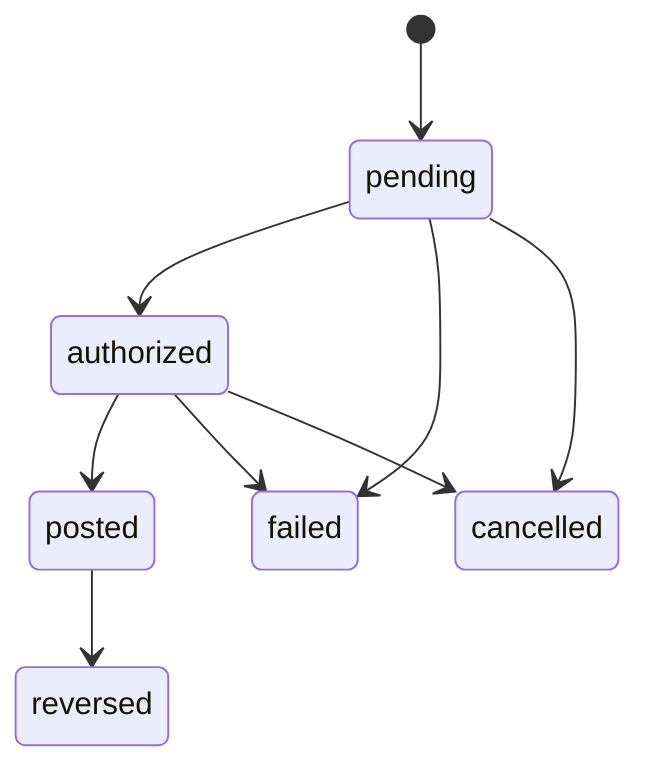

## Learning Challenge:

### 1. Write the algorithm (in pseudocode) for calculating account balance from transactions

- A transaction is not a balance.
- Balance = cumulative effect of all settled (posted) transactions.
- Never trust just one transaction to tell you the full story.

```txt
Pseudocode for calculating account balance from transactions. since we're using the ledger transaction.

1. get all transactions in transaction table where status is posted
2. initialize account balance as 0
3. we then sum up all the transaction amount here
    - if the direction is credit, we add up to to the account balance
    - if the direction is debit, we subtract from the account balance
4. the final output after doing all this summation gives the account balance
```

### 2. Design the state machine for transaction status transitions



### 3. Plan the data validation rules for each entity (what makes data invalid?)

You're definitely on the right track! What you've written is **correct logic** — it's a validation rule based on accounting principles. Let me help you **structure** all the validation rules for your entities more clearly and add more where relevant.

---

## ✅ 3. Validation Rules for Each Entity

---

### 🔹 `User` Entity

| Field                        | Rule                                                            |
| ---------------------------- | --------------------------------------------------------------- |
| `email`                      | Must be valid email format and unique                           |
| `password`                   | Must be hashed and meet minimum strength (e.g., 8+ chars, etc.) |
| `name`                       | Required, non-empty string                                      |
| `is_deleted`                 | Boolean only, default `false`                                   |
| `created_at`, `last_updated` | Must be valid timestamps, not null                              |

---

### 🔹 `Account` Entity

| Field                        | Rule                                                                                          |
| ---------------------------- | --------------------------------------------------------------------------------------------- |
| `user_id`                    | Must exist in `User` table (foreign key constraint)                                           |
| `name`                       | Required, non-empty                                                                           |
| `type`                       | Must be in enum list (`bank`, `cash`, `credit_card`, etc.)                                    |
| `currency`                   | Must be valid ISO 4217 currency code (e.g., `USD`, `GHS`)                                     |
| `is_deleted`                 | Boolean only, default `false`                                                                 |
| `account_balance`            | Optional/stored or computed — **should never go negative** if account doesn't allow overdraft |
| `created_at`, `last_updated` | Required timestamps                                                                           |

---

### 🔹 `Transaction` Entity

| Field                     | Rule                                                                                                                    |
| ------------------------- | ----------------------------------------------------------------------------------------------------------------------- |
| `account_id`              | Must exist in `Account` table                                                                                           |
| `amount`                  | hello                                                                                                                   |
| `direction`               | Must be either `credit` or `debit`                                                                                      |
| `status`                  | Must match enum values (pending, posted, failed, etc.)                                                                  |
| `currency`                | Must match the account's currency unless handling conversions                                                           |
| `reversed_transaction_id` | If set, must point to an existing `transaction` and must **mirror** that transaction (amount, opposite direction, etc.) |
| `category_id`             | Must exist in `Categories` table                                                                                        |
| `description`             | Optional, but sanitize input (avoid malicious HTML)                                                                     |
| `posted_at`, `created_at` | Must be valid timestamps                                                                                                |

- **Status flow**: Invalid if status jumps from `pending` → `posted` without going through `authorized` in some flows (enforce via state machine logic)
- If `direction` is `debit`, amount **must be negative or zero**
- If `direction` is `credit`, amount **must be positive or zero**

---

### 🔹 `Category` Entity

| Field  | Rule                                                    |
| ------ | ------------------------------------------------------- |
| `type` | Must be `credit` or `debit` only (to match direction)   |
| `name` | Must be unique per user or globally depending on design |

---

## 💡 Additional Custom Logic Ideas

- **No duplicate reversal:** A transaction should not be reversed more than once.
- **Currency mismatch:** Reject a transaction if the currency differs from account unless you have FX logic.
- **Account deletion:** Don’t allow transactions on a soft-deleted account.
- **Cross-user access:** User A cannot insert a transaction on an account belonging to User B.

---

## ✅ Eg:

> 💬 **“Debit-direction transaction cannot be positive; credit-direction transaction cannot be negative.”**

```sql
CHECK (
  (direction = 'debit' AND amount <= 0)
  OR
  (direction = 'credit' AND amount >= 0)
)
```

Or in code:

```ts
if (direction === "debit" && amount > 0) throw Error("Debit must be <= 0");
if (direction === "credit" && amount < 0) throw Error("Credit must be >= 0");
```
